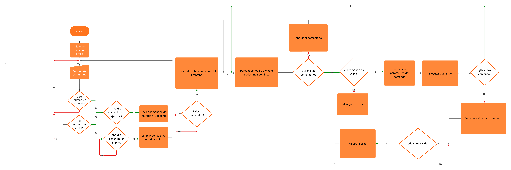
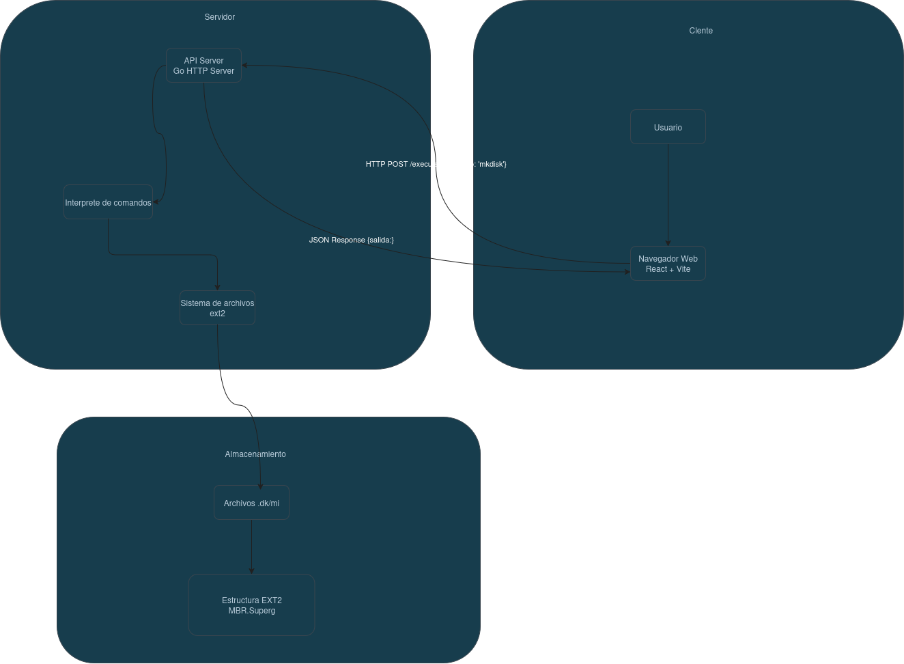
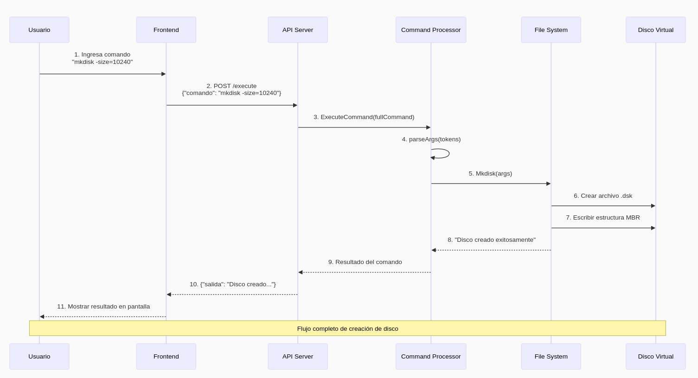

# Manual Técnico - Sistema de Archivos EXT2 Simulado

+ Autor: José Emanuel Monzón Lémus
+ Carnet: 202300539
+ Curso: Manejo e implementación de archivos B 
+ Repositorio: https://github.com/0520Jose/MIA_2S2025_P1_202300539.git

---

## 1. Arquitectura del Sistema

El sistema simula el funcionamiento de un sistema de archivos EXT2 a través de una aplicación web compuesta por dos módulos principales: **Frontend** y **Backend**. A continuación se describe en detalle la estructura, interacción y flujo de datos entre estos componentes.

---

### 1.1. Frontend

- **Tecnologías:**  
  - React (JavaScript)
  - Vite (herramienta de desarrollo y empaquetado)
- **Funcionalidad:**  
  - Proporciona una interfaz gráfica intuitiva para el usuario.
  - Permite ingresar comandos relacionados con la gestión de discos, particiones, usuarios, archivos y reportes.
  - Visualiza resultados, mensajes de error y reportes generados por el backend.
  - Envía solicitudes HTTP (usualmente POST o GET) al backend para ejecutar acciones.
- **Estructura:**  
  - Componentes para el ingreso de comandos.
  - Ingreso de archivos script tipo .mia.
  - Paneles para mostrar resultado.

---

### 1.2. Backend

- **Tecnologías:**  
  - Go (Golang)
  - API REST (servidor HTTP)
- **Funcionalidad:**  
  - Recibe y procesa comandos enviados por el frontend.
  - Interpreta los comandos y ejecuta la lógica correspondiente (creación de discos, manejo de particiones, gestión de usuarios, manipulación de archivos y directorios, generación de reportes, etc.).
  - Modifica el archivo binario `.mia` que representa el disco virtual y sus estructuras internas (MBR, EBR, inodos, bloques, etc.).
  - Devuelve respuestas estructuradas (JSON) con resultados, mensajes de error o archivos generados (por ejemplo, imágenes de reportes).
- **Estructura:**  
  - Módulo de interpretación de comandos.
  - Módulo de manejo de estructuras de datos del sistema de archivos.
  - Módulo de autenticación y permisos.
  - Módulo de generación de reportes.
  - API REST para comunicación con el frontend.

---

### 1.3. Comunicación Frontend-Backend

- **Protocolo:** HTTP/REST
- **Formato de datos:** JSON para solicitudes y respuestas.
- **Endpoints típicos:**
  - `/api/command` para ejecutar comandos.
- **Seguridad:**  
  - Validación de comandos y parámetros.

---

### 1.4. Flujo de Operación


---

### 1.5. Diagrama de Arquitectura

#### Diagrama de Componentes y Flujo de Datos



#### Diagrama de Secuencia (Ejemplo de Comunicación)


---

### 1.6. Ejemplo de Comunicación

**Ejemplo de solicitud desde el frontend:**
```json
POST /execute'
{
# Crear disco de 20 MB
mkdisk -size=20 -unit=M -path="/home/emanuel/Disco3.mia"

# Crear primera partición primaria de 3 MB
fdisk -size=3 -unit=M -type=P -path="/home/emanuel/Disco3.mia" -name=Primaria1

# Montar una partición para probar el resto del sistema
mount -path="/home/emanuel/Disco3.mia" -name=Primaria1

# Formatear partición montada (usa el ID que te devuelva mount)
mkfs -id=391A

# Iniciar sesión
login -user=root -pass=123 -id=391A

#   MANEJO DE USUARIOS  #

# Crear grupo de desarrolladores (máximo 10 caracteres)
mkgrp -name=devs -id=391A

# Crear usuario administrador (máximo 10 caracteres)
mkusr -user=admin -pass=admin123 -grp=devs -id=391A

#   CREACIÓN DE ARCHIVOS Y CARPETAS  #

# Crear carpeta personal de usuario
mkdir -path="/home" -id=391A
mkfile -path="/home/perfil.txt" -size=100 -id=391A

#   VER CONTENIDO DE ARCHIVOS  #

cat -file="/home/admin/perfil.txt" -id=391A
cat -file="/home/admin/docs/notas.txt" -id=391A

# Cerrar sesión
logout
}
```

**Ejemplo de respuesta del backend:**
```json
{
    # Crear disco de 20 MB
Disco creado exitosamente: /home/emanuel/Disco3.mia (20971520 bytes) [fit=FF]


# Crear primera partición primaria de 3 MB
Partición creada: Primaria1

# Montar una partición para probar el resto del sistema
 - 391A: Primaria1 (/home/emanuel/Disco3.mia)


# Formatear partición montada (usa el ID que te devuelva mount)
Sistema de archivos EXT2 creado correctamente en la partición con ID 391A

# Iniciar sesión
Login exitoso

#   MANEJO DE USUARIOS  #

# Crear grupo de desarrolladores (máximo 10 caracteres)
Grupo 'devs' creado exitosamente con ID 2

# Crear usuario administrador (máximo 10 caracteres)
Usuario 'admin' creado exitosamente en el grupo 'devs' con ID 2

#   CREACIÓN DE ARCHIVOS Y CARPETAS  #

# Crear carpeta personal de usuario
Carpeta creada exitosamente
Archivo creado exitosamente

#   VER CONTENIDO DE ARCHIVOS  #

Error: /home/admin/perfil.txt -> entrada no encontrada: admin
Error: /home/admin/docs/notas.txt -> entrada no encontrada: admin

# Cerrar sesión
Logout exitoso

}
```

---

### 1.7. Consideraciones de Diseño

- El sistema está diseñado para ser modular y escalable, permitiendo agregar nuevos comandos y funcionalidades fácilmente.
- La separación entre frontend y backend facilita el mantenimiento y la evolución del sistema.
- El uso de una API REST permite la integración con otras interfaces o herramientas externas en el futuro.

---

## 2. Estructuras de Datos

El sistema simula las principales estructuras del sistema de archivos EXT2:

### MBR (Master Boot Record)
- **Función:** Define las particiones del disco.
- **Campos principales:** tamaño, fecha de creación, particiones (primarias y extendidas).

```golang
type MBR struct {
    Mbr_tamano         int32
    Mbr_fecha_creacion [16]byte
    Mbr_dsk_signature  int32
    Dsk_fit            byte
    Mbr_partitions     [4]Partition
}
```

### Partition
- **Función:** Define las particiones primarias y extendidas del disco.
- **Campos principales:** estado, tipo, inicio, tamaño.

```golang
type Partition struct {
    Part_status      byte
    Part_type        byte
    Part_fit         byte
    Part_start       int32
    Part_s           int32
    Part_name        [16]byte
    Part_correlative int32
    Part_id          [4]byte
}
```

### EBR (Extended Boot Record)
- **Función:** Gestiona particiones lógicas dentro de una partición extendida.
- **Campos principales:** estado, tipo, inicio, tamaño, siguiente.

```golang
type EBR struct {
    Part_mount byte
    Part_fit   byte
    Part_start int32
    Part_s     int32
    Part_next  int32
    Part_name  [16]byte
}
```

### Superbloque
- **Función:** Contiene información global del sistema de archivos (cantidad de inodos, bloques, etc.).
- **Campos principales:** número de inodos, número de bloques, tamaño de bloque, etc.

```golang
type SuperBloque struct {
    S_filesystem_type   int32
    S_inodes_count      int32
    S_blocks_count      int32
    S_free_blocks_count int32
    S_free_inodes_count int32
    S_mtime             [17]byte
    S_umtime            [17]byte
    S_mnt_count         int32
    S_magic             int32
    S_inode_s           int32
    S_block_s           int32
    S_first_ino         int32
    S_first_blo         int32
    S_bm_inode_start    int32
    S_bm_block_start    int32
    S_inode_start       int32
    S_block_start       int32

}
```

### Inodos
- **Función:** Representan archivos y directorios, almacenan metadatos y punteros a bloques.
- **Campos principales:** tipo, permisos, usuario, grupo, tamaño, punteros a bloques.

```golang
type Inodo struct {
    I_uid   int32
    I_gid   int32
    I_s     int32
    I_atime [17]byte
    I_ctime [17]byte
    I_mtime [17]byte
    I_block [15]int32
    I_type  [1]byte
    I_perm  [3]byte
}
```

### Bloques
- **Función:** Almacenan datos de archivos y directorios.
- **Tipos:** Bloques de datos (contenido de archivos), bloques de carpetas (listado de archivos/directorios).

#### Bloques de Contenido
- Almacenan información sobre archivos.
```golang
type BContent struct {
    B_name  [12]byte
    B_inodo int32
}
```

#### Bloques de Carpeta
- Almacenan información sobre directorios.
```golang
type BCarpeta struct {
    B_content [4]BContent
}
```

#### Bloques de Archivo
- Almacenan información sobre archivos.
```golang
type BArchivo struct {
    B_content [64]byte
}
```
#### Bloques de Apuntadores
- Almacenan punteros a otros bloques.
```golang
type BApuntadores struct {
    B_pointers [16]int32
}
```

### Bitmaps
- **Función:** Indican qué inodos y bloques están ocupados o libres.

```golang
type Bitmap []byte
```

### Estructuras de Usuarios y Grupos
- **Función:** Gestionan la autenticación y permisos de usuarios y grupos.

#### Grupo
- **Función:** Representa a un grupo de usuarios del sistema.
```golang
type Grupo struct {
	GID    int
	Nombre string
}
```

#### Usuario
- **Función:** Representa a un usuario del sistema.
```golang
type Usuario struct {
	UID        int
	Grupo      string
	Nombre     string
	Contrasena string
}
```

#### UsersTXT
- **Función:** Almacena la información de usuarios y grupos en un archivo de texto simulado dentro del sistema de archivos.

```golang
type UsersTXT struct {
	Grupos   []Grupo
	Usuarios []Usuario
}

func (u *UsersTXT) ToString() string {
	var sb strings.Builder
	for _, g := range u.Grupos {
		sb.WriteString(fmt.Sprintf("%d,G,%s\n", g.GID, g.Nombre))
	}
	for _, usr := range u.Usuarios {
		sb.WriteString(fmt.Sprintf("%d,U,%s,%s,%s\n", usr.UID, usr.Grupo, usr.Nombre, usr.Contrasena))
	}
	return sb.String()
}
```

---

## 3. Comandos Implementados

A continuación se listan todos los comandos implementados, su descripción, parámetros y ejemplos de uso.

### MKDISK
- **Descripción:** Crea un nuevo disco virtual `.mia`.
- **Parámetros:**  
  - `-size`: Tamaño del disco (obligatorio)  
  - `-unit`: Unidad (K, M). Por defecto M  
  - `-fit`: Tipo de ajuste (FF, BF, WF). Por defecto FF  
  - `-path`: Ruta donde crear el disco (obligatorio)
- **Ejemplo:**
  ```
      mkdisk -size=10 -unit=M -path="/tmp/disco1.mia"
  ```
- **Efecto:** Inicializa el archivo binario con MBR y espacio para particiones.

---

### RMDISK
- **Descripción:** Elimina un disco virtual.
- **Parámetros:**  
  - `-path`: Ruta del disco a eliminar
- **Ejemplo:**
  ```
  rmdisk -path=/home/user/disco1.mia
  ```
- **Efecto:** Elimina el archivo binario del disco.

---

### FDISK
- **Descripción:** Gestiona particiones en el disco.
- **Parámetros:**  
  - `-size`: Tamaño de la partición  
  - `-unit`: Unidad (K, M, B)  
  - `-path`: Ruta del disco  
  - `-type`: Tipo (P=primaria, E=extendida, L=lógica)  
  - `-fit`: Ajuste (FF, BF, WF)  
  - `-name`: Nombre de la partición
- **Ejemplo:**
  ```
  fdisk -size=3 -path="/tmp/disco1.mia" -name="Particion1" -type=P
  ```
- **Efecto:** Modifica el MBR/EBR para agregar o modificar particiones.

---

### MOUNT
- **Descripción:** Monta una partición para su uso.
- **Parámetros:**  
  - `-path`: Ruta del disco  
  - `-name`: Nombre de la partición
- **Ejemplo:**
  ```
  mount -path="/tmp/disco1.mia" -name="Particion1"
  ```
- **Efecto:** Registra la partición como activa en el sistema.

---

### MOUNTED
- **Descripción:** Lista las particiones actualmente montadas.
- **Parámetros:** Sin parámetros.
- **Ejemplo:**
  ```
  mounted
  ```
- **Efecto:** Muestra las particiones activas.

---

### MKFS
- **Descripción:** Formatea una partición con el sistema de archivos EXT2.
- **Parámetros:**  
  - `-id`: ID de la partición montada  
  - `-type`: Tipo de formateo (fast)
- **Ejemplo:**
  ```
  mkfs -id="281A" -type=fast
  ```
- **Efecto:** Inicializa estructuras internas (superbloque, inodos, bloques).

---

### LOGIN
- **Descripción:** Inicia sesión en el sistema de archivos.
- **Parámetros:**  
  - `-user`: Usuario  
  - `-pass`: Contraseña  
  - `-id`: Identificador de la partición montada
- **Ejemplo:**
  ```
  login -user=root -pass=123 -id="391A"
  ```
- **Efecto:** Autentica al usuario y permite ejecutar comandos con permisos.

---

### MKGRP
- **Descripción:** Crea un nuevo grupo de usuarios.
- **Parámetros:**  
  - `-name`: Nombre del grupo
- **Ejemplo:**
  ```
  mkgrp -name=grupo1
  ```
- **Efecto:** Agrega un grupo al sistema.

---

### RMGRP
- **Descripción:** Elimina un grupo de usuarios.
- **Parámetros:**  
  - `-name`: Nombre del grupo
- **Ejemplo:**
  ```
  rmgrp -name=grupo1
  ```
- **Efecto:** Elimina el grupo del sistema.

---

### MKUSR
- **Descripción:** Crea un nuevo usuario.
- **Parámetros:**  
  - `-user`: Nombre de usuario  
  - `-pass`: Contraseña  
  - `-grp`: Grupo al que pertenece
- **Ejemplo:**
  ```
  mkusr -user=usuario1 -pass=123 -grp=grupo1
  ```
- **Efecto:** Agrega un usuario al sistema.

---

### RMUSR
- **Descripción:** Elimina un usuario.
- **Parámetros:**  
  - `-user`: Nombre de usuario
- **Ejemplo:**
  ```
  rmusr -user=usuario1
  ```
- **Efecto:** Elimina el usuario del sistema.

---

### MKDIR
- **Descripción:** Crea un nuevo directorio.
- **Parámetros:**  
  - `-path`: Ruta del directorio  
  - `-p`: (Opcional) Crea directorios padres si no existen
- **Ejemplo:**
  ```
  mkdir -path=/carpeta1/carpeta2 -p
  ```
- **Efecto:** Agrega un inodo y bloque de carpeta.

---

### MKFILE
- **Descripción:** Crea un nuevo archivo.
- **Parámetros:**  
  - `-path`: Ruta del archivo  
  - `-size`: Tamaño del archivo  
  - `-cont`: Contenido del archivo  
  - `-p`: (Opcional) Crea directorios padres si no existen
- **Ejemplo:**
  ```
  mkfile -path=/carpeta1/archivo.txt -size=100 -cont="Hola mundo" -p
  ```
- **Efecto:** Agrega un inodo y bloque de datos.

---

### CAT
- **Descripción:** Muestra el contenido de uno o varios archivos.
- **Parámetros:**  
  - `-file`: Ruta(s) de archivo(s)
- **Ejemplo:**
  ```
  cat -file=/carpeta1/archivo.txt
  ```
- **Efecto:** Muestra el contenido del archivo.

---

### CHGRP
- **Descripción:** Cambia el grupo de un usuario.
- **Parámetros:**  
  - `-user`: Usuario  
  - `-grp`: Nuevo grupo
- **Ejemplo:**
  ```
  chgrp -user=usuario1 -grp=grupo2
  ```
- **Efecto:** Modifica el grupo del usuario.

---

### REPORTES
- **Descripción:** Genera reportes visuales del sistema de archivos.
- **Parámetros:**  
  - `-name`: Tipo de reporte (mbr, disk, inode, block, bm_inode, bm_block, tree, sb, file, ls)  
  - `-path`: Ruta de salida  
  - `-id`: ID de partición  
  - `-ruta`: Ruta específica (solo para algunos reportes)
- **Ejemplo:**
  ```
  rep -name=mbr -path="/tmp/reporte_mbr.txt" -id="391A"
  ```
- **Efecto:** Genera un reporte visual del sistema de archivos.

---
